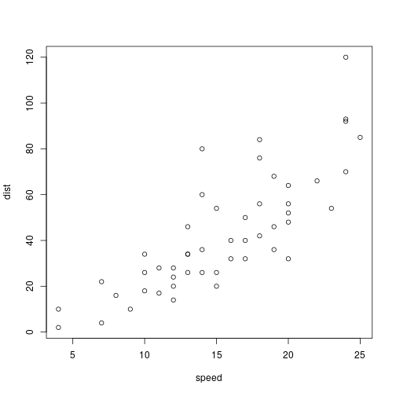

Spatial data visualization with R and Friends
========================================================
author:Aaron C Cochran 
date: 04-10-2018
autosize: true

Installing packages
========================================================


```r
install.packages("devtools")
devtools::install_github("tidyverse/ggplot2", force=TRUE) # development version!

install.packages(c("leaflet", "viridis", "sf","sp", "tidyverse", "spdep", "rgdal"))
```


Maps in R
========================================================

Many options for maps
* ggplot2 - static maps
* ggplotly - interactive maps using plotly.js, built on D3.js
* mapview - simplified leaflet
* leaflet - presentation-grade maps


Slide With Plot
========================================================


